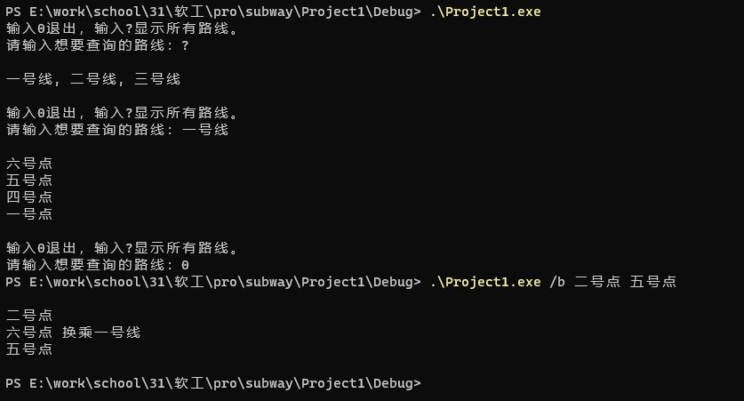
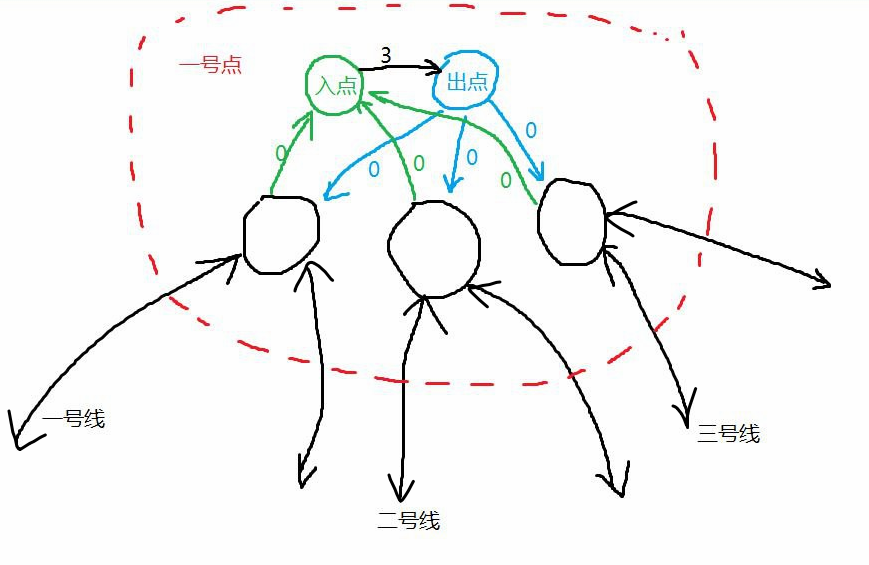
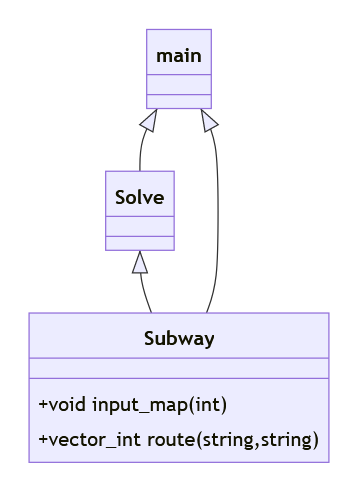
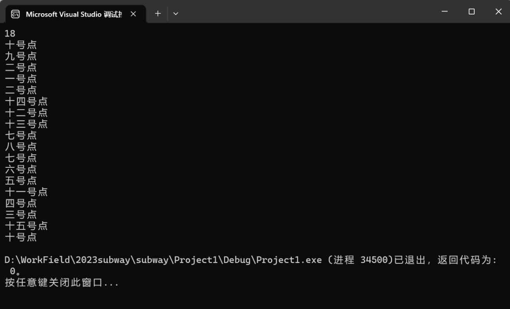

# 第一周工作总结（5.18~5.25）

## DAY1.熟悉git与结对开发流程
在gitlab上fork了老师“地铁漫游”的项目仓库。\
安装git后使用 `git clone https://gitlab.bitcs.net.cn/1120203273/subway.git` 在本地仓库克隆了项目文件。实现了与上游仓库保持同步，和队友一起测试了各种git指令，初步熟悉了git的用法与结对开发程序的流程，并统一决定使用c++和vs2017进行程序开发。\
对地铁换乘服务功能如何抽象成不同的功能模块进行了初步思考。\
等待老师发布需求文件。

## DAY2.
老师发布了第一份需求文件。今天在简易版本的测试地图1中实现了以下功能：\
1.用户输入路线号，程序输出该路线上的全部站点；\
2.用户输出起点和终点，程序输出最短路径规划，并在换乘站点给出提示。\
3.功能二没有输出路径的站点数，明天补齐。
  

功能一、功能二测试图如下：

## DAY3.

补齐了功能二，开始试图实现功能三。\
初步讨论了功能三、四的具体写法。

## DAY4.

继续讨论了功能三、四的写法。

在简易版本的测试地图2中实现了以下功能：\
1.功能一用户输入路线号，程序输出该路线上的全部站点；\
2.功能二用户输出起点和终点，程序输出最短路径规划，并在换乘站点给出提示。\
3.功能三（未完成版，且未考虑换乘开销）用户输入起点，程序输出经过所有站点的路径与经过的总站点数，这个路径是没有执行优化算法的，是随机解，可能可以通过多次随机找出经过的总站点数最少的路径解，将其视作伪最优解。

## DAY5.

总结了之前的讨论成果：

1. 算法类型的选取。\
   考虑到此问题与旅行商问题、哈密顿回路等经典NP问题的相似性，它难以在多项式时间内解决。而指数规模的算法是无法接收的。在只算总共58个换乘站点的情况下，需要运行约$2^{58}$次，单线程的情况下总共耗时几十年，不现实。因此考虑使用最优化算法。

2. 模拟退火算法的具体操作。
   + 问题转换：对于一条环游所有站点的路线，把所有站点按照第一次到达的先后顺序组成一个排列。一个排列的代价就是从第一个数按顺序到最后一个数，再回到第一个数在图上所对应的最短路径长度之和。因此任务从求最短路径变成了求代价最小的排列。（可以证明：最优路线所对应的排列一定可以重新映射回到该路线）
   + 初始解生成：完全随机生成一个排列。
   + 随机调整：对于一个排列，每次随机取出其中两个数进行交换，是一次调整。

3. 对于功能四，决定采用拆点的方法来实现换乘额外距离+3。\
   \
   对于每一个有k条线经过换乘站点，把它拆分成k+2个点。\
   这种结构能做到：不换线则没有额外开销(其实增加了额外开销是3n(n>0)的路线，但是由于我们求的是最短路，所以不会走那些路线)，换线则都至少额外增加3开销

## DAY6.

讨论了北京地铁特殊部分（首都机场线）的相关问题，发现北京市地铁图中存在单向边、环路，需要修改输入格式、修改数据储存结构。\
开始编写 subway3.txt ，该测试文件对应的地图即北京地铁地图。

由于单个文件内容过多，不便维护，考虑把项目结构修改为如下形式（待完善）：\
\
其中`Subway`提供对地图本身的基本操作，包括文本读入、解析、建图、图上最短路的计算。
`Solve`调用`Subway`的功能，提供解决需求的算法，包括需求1中站点查询的简单包装、需求2中两点最短路径的简单包装和需求3、4中模拟退火算法的主体实现与包装。
`main`处理用户交互逻辑，并与`Solve`和`Subway`进行对接。

先不修改`main`，从另外两个部分开始写，可以在保证上一阶段的代码仍然可用的情况下，完成新结构的编写。最后修改`main`，调用已经写好的另外两部分即可。

今天完成进度：`Subway` 50%

## DAY7.
功能三测试：\
测试对象：测试地图2\
测试站点：十号点\
\
