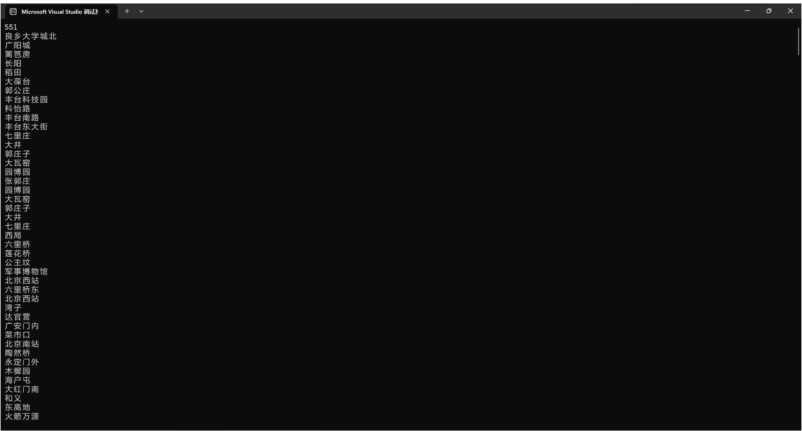
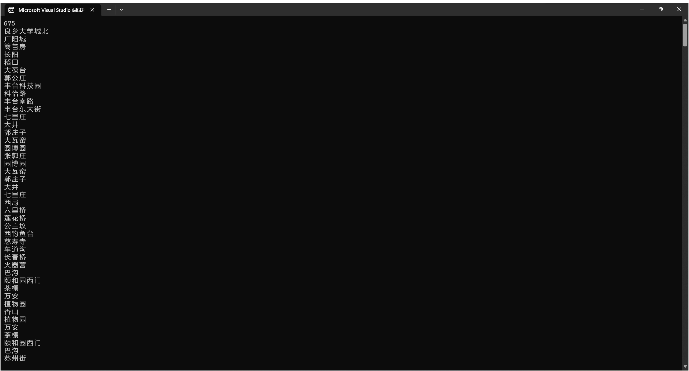
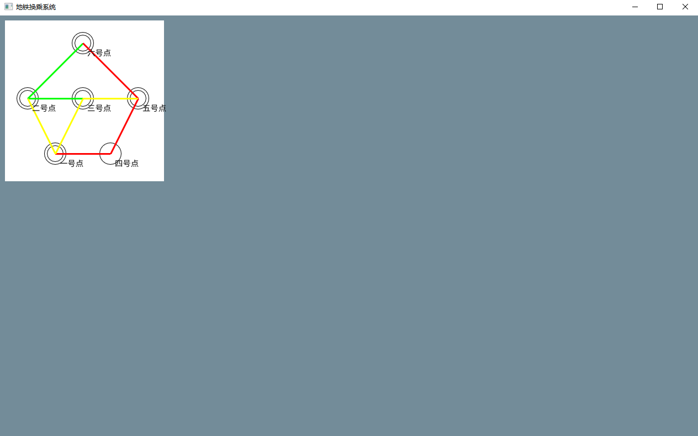
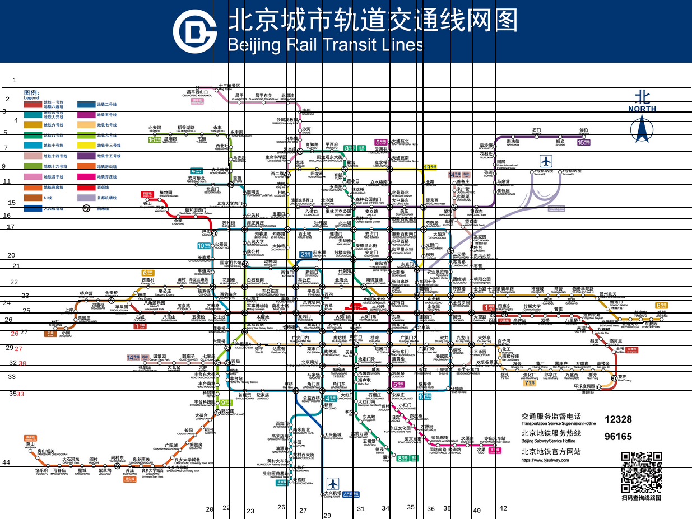
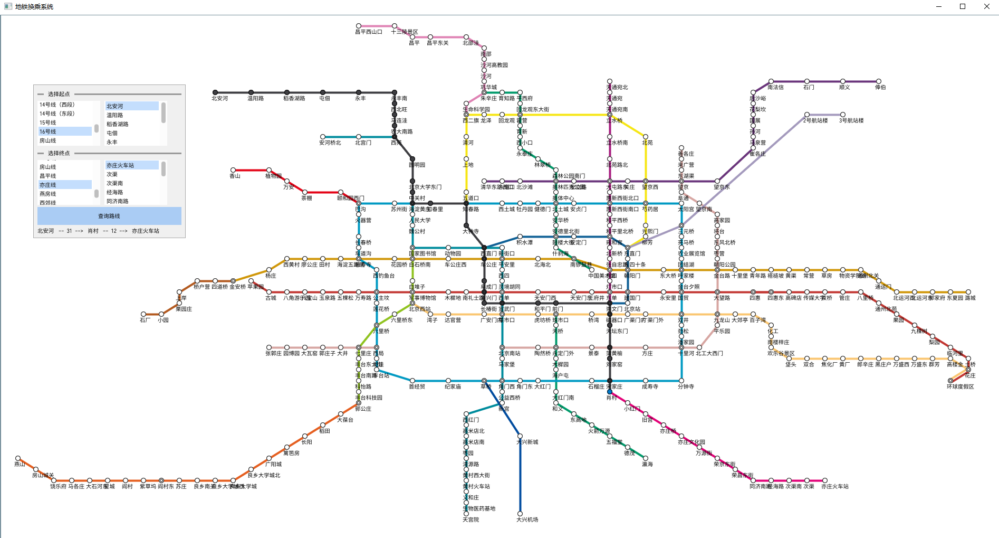
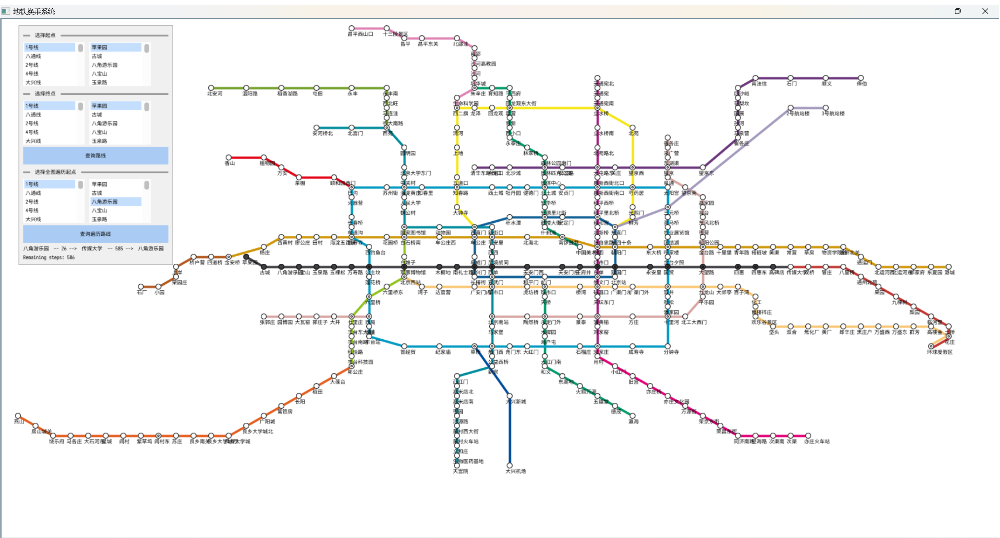

# 第二周工作总结

## DAY1.重新探讨了模拟退火算法，并用代码实现
摒弃了之前的模拟退火算法思路，采取了新思路\
流程如下：\
1.如果在某站点有未走过的邻居节点，优先走邻居，如果有多个邻居，就随机选择一个邻居\
2.如果邻居都走过了，就在全局检索，将所有未走过的节点列出来，并求出到他们的距离\
3.将节点按照距离从小到大依次排序，排在前的权重大，排在后的权重小\
4.按照一定的算法计算权重值（详情见代码），然后按照权重随机取一个节点作为下一跳站点\
5.输入起点终点进行bfs，并在bfs路径上进行访问标记\
6.计算步数，记录路径，如果还有未走节点就转到1\
7.如果没有未走节点，就将起始点作为终点进行bfs，得到最终的路径结果

测试图如下：

## DAY2.考虑换乘开销
因为在模拟退火算法中取权重是根据距离取的，如果考虑换乘开销只需要在有线路变更时距离+3即可，其他全部不需要改变

测试图如下：

## DAY3.算法优化
我们知道在经典的退火算法中，常数因子k的取值是至关重要的，不同的k的函数收敛效率大相径庭。\
在本程序中，权重计算公式迭代了5次，第一次迭代为: P[i] = e^(-1×i) ，i为数组排序的序号，因为本身数组是按照距离从小到大排序好的，此时算法收敛速度一般，但考虑到如果有相等距离的点权重却不同，需要对公式进行修改。\
第二次迭代为：P[i] = e^(-1*dis_global[i]) ，效果比第一次迭代反而更差。对于i=0和i=1的点，如果用第一次迭代的算法，他们权重的值为分别为1和0.36788，比率为2.71828；第二次迭代的算法对于距离2和距离3的点，他们权重的值为分别为0.13533和0.04978，比率为2.71828\
修改常数因子为10，得到第三次迭代：P[i] = e^(-1×10×dis_global[i])，距离收敛速度明显提升，算法效率明显提升。\
修改常数因子为100，得到第四次迭代：P[i] = e^(-1×100×dis_global[i])，相较于迭代三没有明显性能提升，但是输出的结果更稳定。\
修改常数因子为1000，得到第五次迭代：P[i] = e^(-1×1000×dis_global[i])，输出的结果更稳定，但是结果不优秀。

最后选定常数因子为100。

修正了程序执行时的警告。

第一次迭代PSP表格：

| PSP                                     | Personal Software Process Stages        | 预估耗时（分钟） | 实际耗时（分钟） |
| --------------------------------------- | --------------------------------------- | ---------------- | ---------------- |
| Planning                                | 计划                                    |        30         |       30        |
| · Estimate                              | · 估计这个任务需要多少时间              |         30       |        30       |
| Development                             | 开发                                    |      1070        |      1120        |
| · Analysis                              | · 需求分析 (包括学习新技术)             |        360        |       360        |
| · Design Spec                           | · 生成设计文档                          |        60        |        60         |
| · Design Review                         | · 设计复审 (和同事审核设计文档)         |        30        |         30        |
| · Coding Standard                       | · 代码规范 (为目前的开发制定合适的规范) |        20        |        10         |
| · Design                                | · 具体设计                              |       60        |        120        |
| · Coding                                | · 具体编码                              |       360        |       300        |
| · Code Review                           | · 代码复审                              |       120        |       120        |
| · Test                                  | · 测试（自我测试，修改代码，提交修改）  |        60        |        120       |
| Reporting                               | 报告                                    |       120        |       120        |
| · Test Report                           | · 测试报告                              |        60        |        60        |
| · Size Measurement                      | · 计算工作量                            |       20         |        20        |
| · Postmortem & Process Improvement Plan | · 事后总结, 并提出过程改进计划          |        40        |         40       |
|                                         | 合计                                    |      1220        |       1270       |

## DAY4.

调研并试用了多种GUI框架，包括nuklear、Dear ImGui、MyGUI、Yue等。最终认为[Dear ImGui](https://github.com/ocornut/imgui)功能满足需求、易于使用，选定为本项目所使用的GUI框架。

把本项目之前已完成的函数加入框架对应平台的示例项目中。并进行了简单的验证。通过底层渲染部分的`draw_list`进行图形绘制，来实现地图绘制。通过在不响应输入的单个无背景窗口中显示文字，来实现站点名称显示。实现了对样例一地图的绘制。

在这个过程中，通过在main函数内加入`system("chcp 65001");`解决了输入的汉字乱码的问题，把项目从vs默认的GB2312编码转换为utf-8编码以适应ui框架。

效果图如下：

## DAY5.

对北京市地铁图进行座标划分，如下图：

添加了输入文件`subway3map.txt`，提供了北京市地铁的站点座标信息和路线信息。
程序现在可以通过读入新的输入文件来显示北京地铁路线图。读取用户环境分辨率，并使用变量进行地图的自适应缩放。

添加了起点、终点选择框和展示路线功能。
用户选择起点与终点后，在地图上动态展示当前所在站点、已经经过的路径、经过的站点数、剩余的站点数。效果图如下：

发现程序在不同分辨率的设备上呈现的效果不同，在低分辨率设备上无法显示完整，于是设置了设备屏幕分辨率的动态读取，根据设备的分辨率动态的调整输出窗口的图形文字大小，以达到较好的表现效果。

## DAY6.
将需求一和需求二的project文件代码整合成功，主项目转移到Project2中。

添加了遍历起点选择框和展示遍历路线功能。
用户选择起点与终点后，在地图上动态展示当前所在站点、已经经过的路径、经过的站点数、剩余的站点数。效果图如下：

第二次迭代PSP表格：

| PSP                                     | Personal Software Process Stages        | 预估耗时（分钟） | 实际耗时（分钟） |
| --------------------------------------- | --------------------------------------- | ---------------- | ---------------- |
| Planning                                | 计划                                    |        30         |       30        |
| · Estimate                              | · 估计这个任务需要多少时间              |         30       |        30       |
| Development                             | 开发                                    |      1070        |      1260        |
| · Analysis                              | · 需求分析 (包括学习新技术)             |        360        |       500        |
| · Design Spec                           | · 生成设计文档                          |        60        |        60         |
| · Design Review                         | · 设计复审 (和同事审核设计文档)         |        30        |         30        |
| · Coding Standard                       | · 代码规范 (为目前的开发制定合适的规范) |        20        |        10         |
| · Design                                | · 具体设计                              |       60        |        120        |
| · Coding                                | · 具体编码                              |       360        |       300        |
| · Code Review                           | · 代码复审                              |       120        |       120        |
| · Test                                  | · 测试（自我测试，修改代码，提交修改）  |        60        |        120       |
| Reporting                               | 报告                                    |       120        |       120        |
| · Test Report                           | · 测试报告                              |        60        |        60        |
| · Size Measurement                      | · 计算工作量                            |       20         |        20        |
| · Postmortem & Process Improvement Plan | · 事后总结, 并提出过程改进计划          |        40        |         40       |
|                                         | 合计                                    |      1220        |       1410       |

## DAY7.
