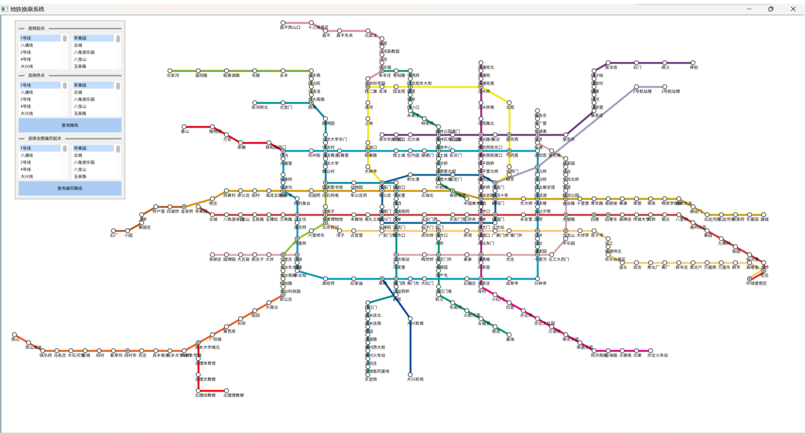
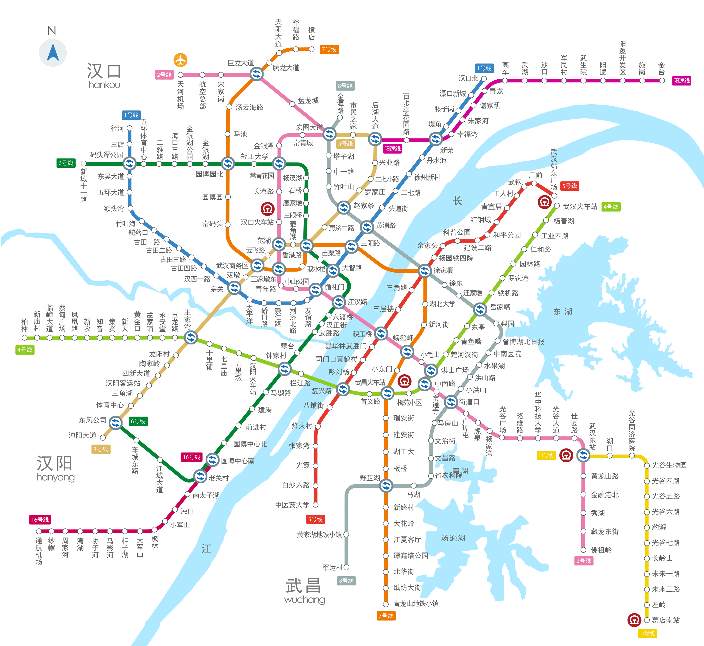
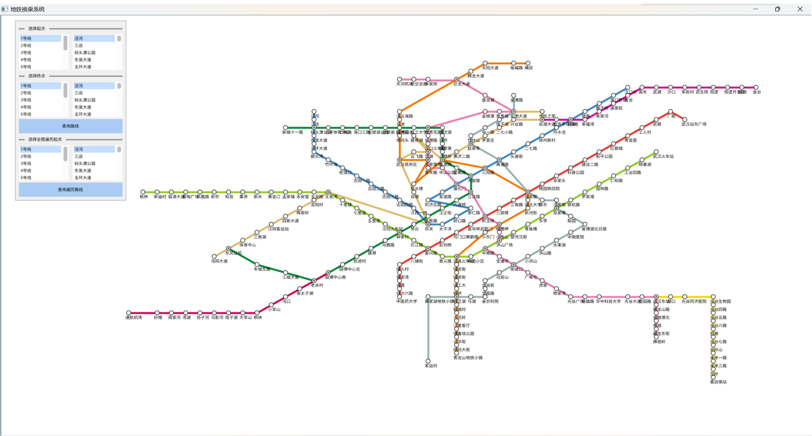
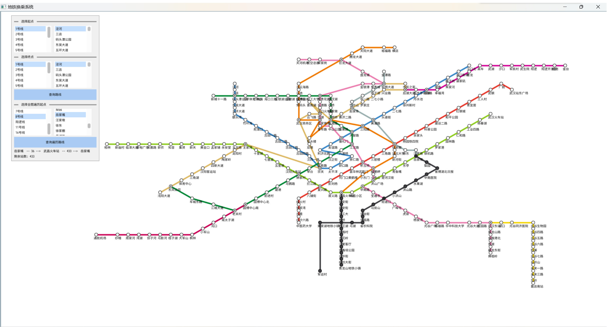
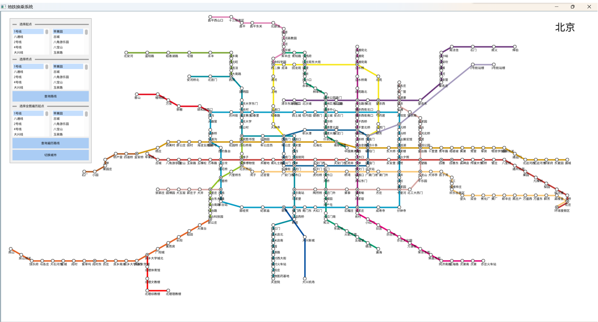
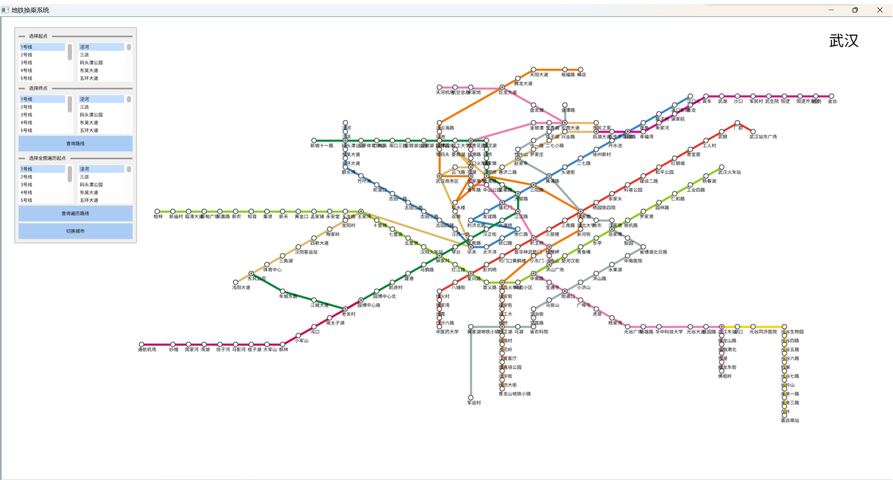
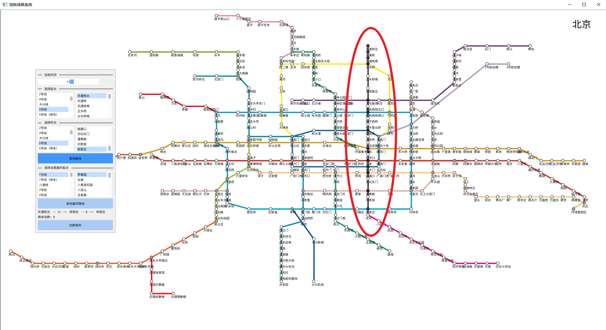
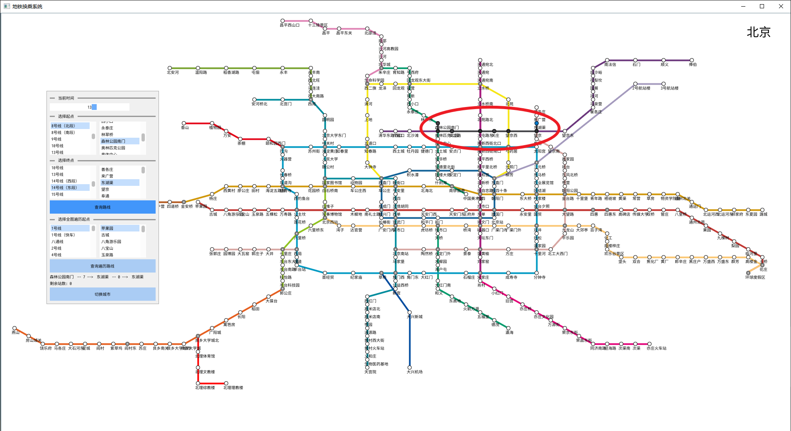
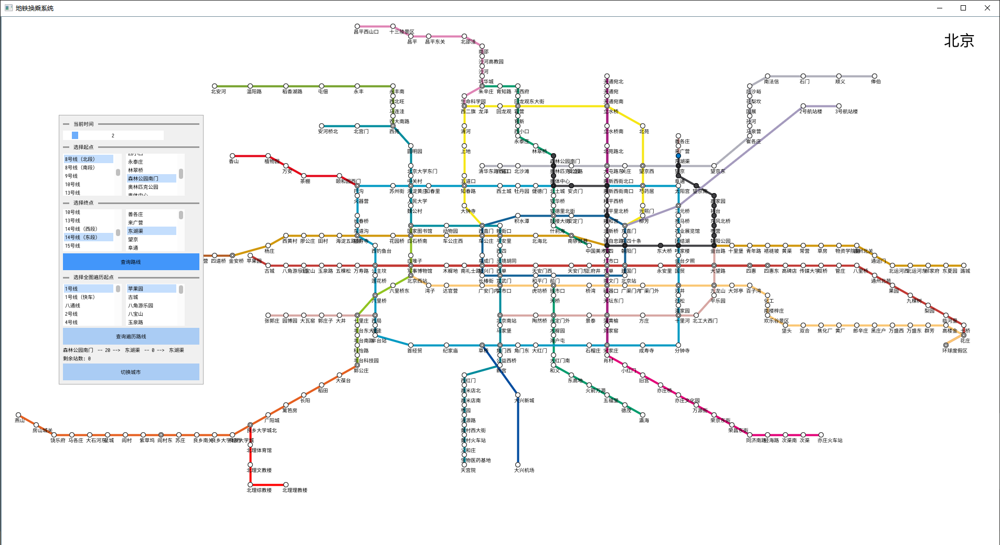
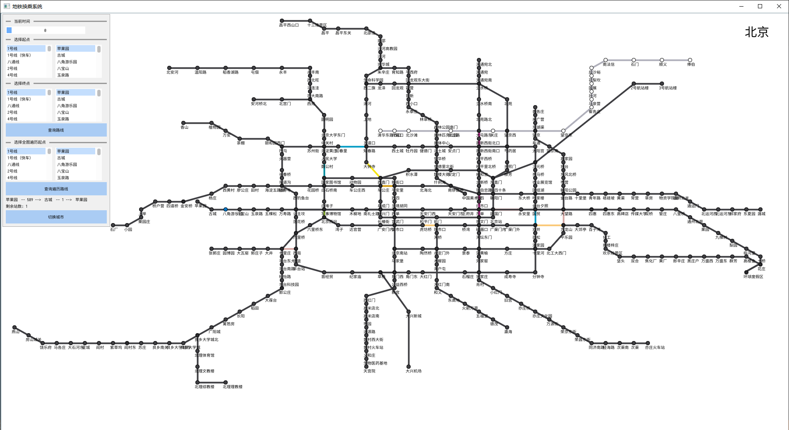

# 第三周工作总结

## DAY1.
按照需求三添加了新的北理良乡线，新站点有北理体育馆、北理文教楼、北理综教楼、北理理教楼，测试图如下：

经功能测试可以正常运行，无bug。

开始制作新的城市的地铁，决定做武汉地铁，武汉地铁的参考图如下：

需要制作的文件分别为wuhanSubway.txt 和 wuhanSubwayMap.txt，分别用于地铁信息初始化和地铁图绘制。

武汉地铁绘图如下：

武汉地铁运行截图如下：

## DAY2.
添加了切换地图按钮，点击即可切换城市，展示图如下：

此外，如果在地图寻路过程中点击“切换城市”按钮，程序就会终止上一个地图的路径展示，转而展示新的城市地图，不会出现bug。

## DAY3.DAY4.DAY5.

完成大站快车和不同时段路线可用性。

修改输入文件，对于大站快车，额外新增一条路线来实现。对于可用时段，在路线名之后可选跟随两个整数，表示开始运行的时间和结束运行的时间。并增加一个当前时间的用户输入。

功能示例如下：

在给5号线添加大站快车后，可以乘坐大站快车通过，此时未停靠的站点颜色仍为白色，停靠的站点才会变色。

给15号线添加运行限制时间。
在运行时间内从`8号线（北段）的森林公园南门`到`14号线（东段）的东湖渠`时，最短路线如下，需要经过15号线：

在运营时间之外，不可用的路线变为浅灰色，同时最短路线发生更改：

遍历路线则不会经过不可用的路线：

第三次迭代PSP表格：

| PSP                                     | Personal Software Process Stages        | 预估耗时（分钟） | 实际耗时（分钟） |
| --------------------------------------- | --------------------------------------- | ---------------- | ---------------- |
| Planning                                | 计划                                    |        10         |       10        |
| · Estimate                              | · 估计这个任务需要多少时间              |         10       |        10       |
| Development                             | 开发                                    |       830       |       920       |
| · Analysis                              | · 需求分析 (包括学习新技术)             |        180        |       180        |
| · Design Spec                           | · 生成设计文档                          |        60        |        60         |
| · Design Review                         | · 设计复审 (和同事审核设计文档)         |        30        |         30        |
| · Coding Standard                       | · 代码规范 (为目前的开发制定合适的规范) |        20        |        10         |
| · Design                                | · 具体设计                              |       60        |        120        |
| · Coding                                | · 具体编码                              |       360        |       400        |
| · Code Review                           | · 代码复审                              |        60        |        60        |
| · Test                                  | · 测试（自我测试，修改代码，提交修改）  |        60        |        60       |
| Reporting                               | 报告                                    |       120        |       120        |
| · Test Report                           | · 测试报告                              |        60        |        60        |
| · Size Measurement                      | · 计算工作量                            |       20         |        20        |
| · Postmortem & Process Improvement Plan | · 事后总结, 并提出过程改进计划          |        40        |         40       |
|                                         | 合计                                    |       960       |       1050       |
